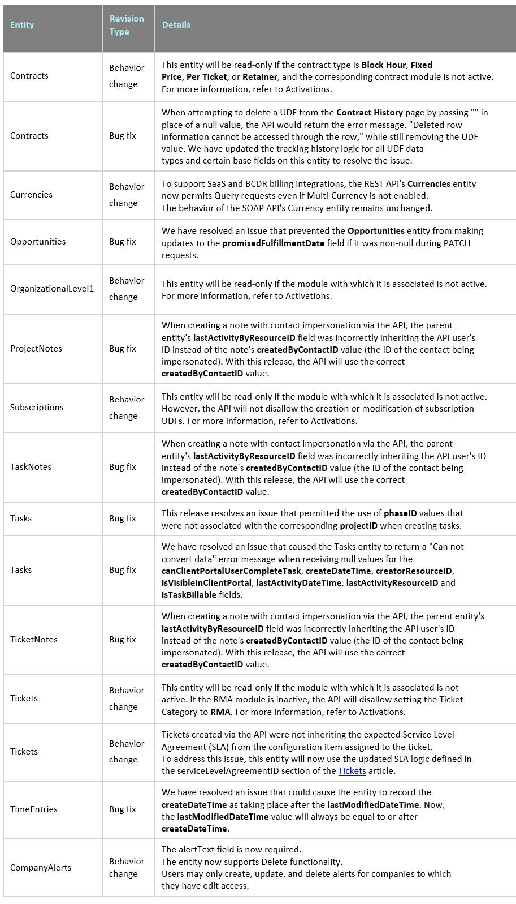
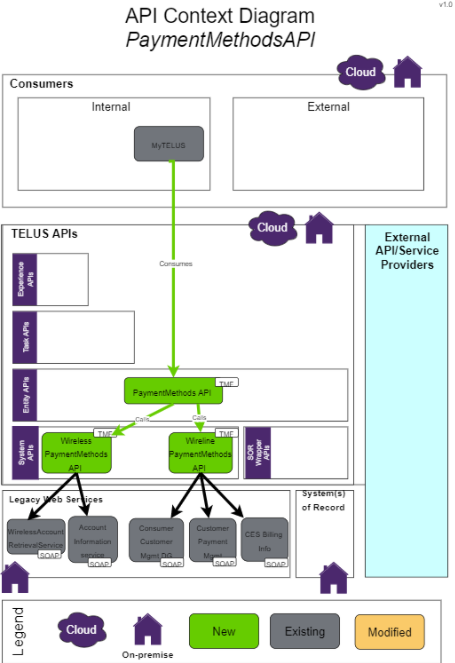
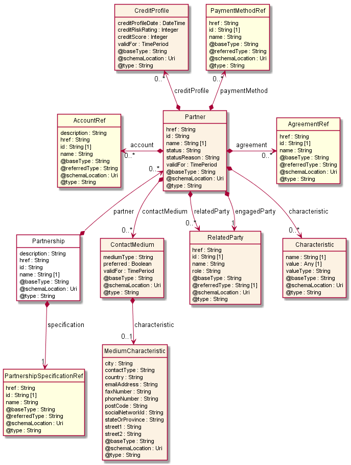
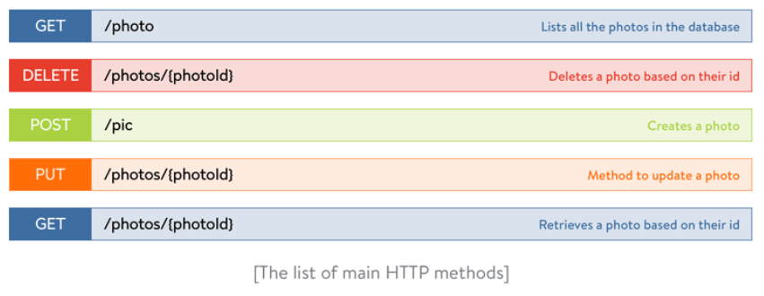
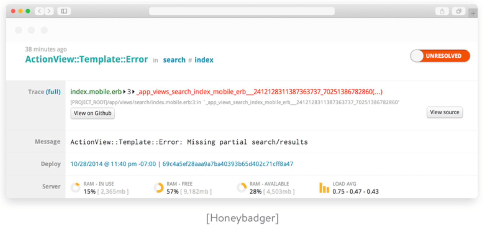

# API Documentation Template

**\
**

# Release History

Below is an example of Release History.

**REST API revision history**

This section contains the revision history of an Example Company's REST API. The latest updates appear first.

**IMPORTANT:**  The SOAP API entered a limited enhancement phase in Q4 2020. Service sunset for version 1.5 will take place in Q4 2021; version 1.6 will sunset in Q4 2024. Visit our SOAP API lifecycle FAQ article to learn more.

**NOTE:**  The REST API uses a two-decimal numbering system to indicate its most current version. The second-place number increases by 1 when a significant update occurs that will likely impact existing integrations.

**Index**

-   Version 1.0 \| Release 2021.3 \| 2021-12-01

-   Previous releases

**Current release**

#### Version 1.0 \| Release 2021.3 \| 2021-12-01

**IMPORTANT:**   Key attributes of the CompanyAlerts entity have changed with the release of Example Company 2021.3. These changes may require updates to your existing integrations. To avoid service disruption, we recommend that you review your applications for compatibility with the updates described in the 2021.3 REST API revision history revision history.

# **Contents** {#contents .TOC-Heading}

[API Documentation Template [1](#api-documentation-template)](#api-documentation-template)

[Release History [2](#release-history)](#release-history)

[Introduction [6](#introduction)](#introduction)

[Overview [6](#overview)](#overview)

[Key Concepts [7](#key-concepts)](#key-concepts)

[Business Scenario [7](#business-scenario)](#business-scenario)

[Architecture [8](#architecture)](#architecture)

[Example API Structure Diagram [8](#example-api-structure-diagram)](#example-api-structure-diagram)

[Entity API [8](#entity-api)](#entity-api)

[Entity Events [8](#entity-events)](#entity-events)

[Operations on Entity [8](#operations-on-entity)](#operations-on-entity)

[Experience API [9](#experience-api)](#experience-api)

[Workflow [9](#workflow)](#workflow)

[Diagrams [9](#diagrams)](#diagrams)

[Creating an API Context Diagram [9](#creating-an-api-context-diagram)](#creating-an-api-context-diagram)

[Example API Workflow diagram [12](#example-api-workflow-diagram)](#example-api-workflow-diagram)

[Two-Factor Authentication REST API [12](#two-factor-authentication-rest-api)](#two-factor-authentication-rest-api)

[Authentication [13](#authentication)](#authentication)

[Use Cases [13](#use-cases)](#use-cases)

[Support of polymorphism and extension patterns [21](#support-of-polymorphism-and-extension-patterns)](#support-of-polymorphism-and-extension-patterns)

[Resource Model [23](#resource-model)](#resource-model)

[Managed Entity and Task Resource Models [23](#managed-entity-and-task-resource-models)](#managed-entity-and-task-resource-models)

[Partnership Specification resource [23](#partnership-specification-resource)](#partnership-specification-resource)

[Partnership resource [26](#partnership-resource)](#partnership-resource)

[Notification Resource Models [33](#notification-resource-models)](#notification-resource-models)

[Example Notification Resource Models [33](#example-notification-resource-models)](#example-notification-resource-models)

[API Operations [35](#api-operations)](#api-operations)

[API Operations Example [35](#api-operations-example)](#api-operations-example)

[API Call flows [36](#api-call-flows)](#api-call-flows)

[API Notifications [36](#api-notifications)](#api-notifications)

[How to design APIs [37](#how-to-design-apis)](#how-to-design-apis)

[Supported data formats [38](#supported-data-formats)](#supported-data-formats)

[Uniform Resource Identifiers [38](#uniform-resource-identifiers)](#uniform-resource-identifiers)

[Endpoints [40](#endpoints)](#endpoints)

[Versioning [41](#versioning)](#versioning)

[Security & authentication [41](#security-authentication)](#security-authentication)

[Scalability and flexibility [42](#scalability-and-flexibility)](#scalability-and-flexibility)

[Monitoring and error handling [43](#monitoring-and-error-handling)](#monitoring-and-error-handling)

[HTTP status codes [43](#http-status-codes)](#http-status-codes)

[Testing, stability, and support [45](#testing-stability-and-support)](#testing-stability-and-support)

[Maintainability [45](#maintainability)](#maintainability)

[Caching [45](#caching)](#caching)

[Expires [45](#expires)](#expires)

[Cache-Control [45](#cache-control)](#cache-control)

[ETag [46](#etag)](#etag)

[Last-Modified [46](#last-modified)](#last-modified)

[Using Postman to explore the REST API [47](#using-postman-to-explore-the-rest-api)](#using-postman-to-explore-the-rest-api)

[Building a simple query [47](#building-a-simple-query)](#building-a-simple-query)

[How to use Postman for API Testing Automation [49](#how-to-use-postman-for-api-testing-automation)](#how-to-use-postman-for-api-testing-automation)

[Example API calls [50](#example-api-calls)](#example-api-calls)

[Get User by ID [50](#get-user-by-id)](#get-user-by-id)

[Update User by ID [52](#update-user-by-id)](#update-user-by-id)

[Delete User by ID [54](#delete-user-by-id)](#delete-user-by-id)

[Example Customer Collection API Call [55](#example-customer-collection-api-call)](#example-customer-collection-api-call)

[Create Customer [55](#create-customer)](#create-customer)

[Get JWT Token [56](#_Toc98260640)](#_Toc98260640)

[Example Get Customer Resource API Call [58](#example-get-customer-resource-api-call)](#example-get-customer-resource-api-call)

**\
**

# Introduction

The API documentation contains information on services the API provides and explains how to use and integrate with the API. It includes information on resources, methods, and parameters, supported by tutorials and examples.

An API reference manual covers the information required to work with the API, with details about the use cases, structure, functions, classes, return types, arguments, and more. It contains a path to API, and operation information, such as authentication methods, parameters, request bodies, response bodies, and headers.

# Overview

APIs make it possible for two separate applications to transfer and share data between them. They also make it easier for an application\'s users to execute actions without having to use the application's GUI.

APIs stand as a go-between for heterogeneous pieces of software. APIs act as a business and technical mediator, or translators between two parties, enabling the passing of information or data requests and responses back and forth. From the developers\' point of view, it\'s an easy way to execute certain functionalities of their app and test it as well.

Explain why your API is needed and include use cases.

-   The business value they can bring/provide

-   How they can be used in a typical business scenario

-   A high-level description of each available API

-   An illustration of their use, based on the description of real-world business scenarios

-   A description of generic usage patterns.

A RESTful API is an architectural style for an application program interface (API) that uses HTTP requests to access and use data. That data can be used to GET, PUT, POST and DELETE data types, which refers to the reading, updating, creating, and deleting of operations concerning resources.

An API for a website is code that allows two software programs to communicate with each other. The API spells out the proper way for a developer to write a program requesting services from an operating system or other application.

A RESTful API -- also referred to as a RESTful web service or REST API -- is based on representational state transfer (REST), which is an architectural style and approach to communications often used in web services development.

REST technology is generally preferred over other similar technologies. This tends to be the case because REST uses less bandwidth, making it more suitable for efficient internet usage. RESTful APIs can also be built with programming languages such as JavaScript or Python.

The REST used by browsers can be thought of as the language of the internet. With cloud use on the rise, APIs are being used by cloud consumers to expose and organize access to web services. REST is a logical choice for building APIs that allow users to connect to, manage and interact with cloud services flexibly in a distributed environment. RESTful APIs are used by such sites as Amazon, Google, LinkedIn and Twitter.

# Key Concepts

APIs typically have important concepts that you may need to describe. This usually depends on the area of knowledge around what the API does. For each concept, write a paragraph or two explaining what it is and how it works. For example, for a learning management system, key concepts might be roles, in other words, the teacher, student, administrator, etc. An online banking system might have concepts like accounts and transactions.

Depending on the type of your API, you may include some of the following sub-sections:

-   What is REST?

-   What is Domain-Driven Design?

-   What is the TM Forum?

-   What are the TMF Open APIs?

-   What are the API Categories?

-   What is a Microservice?

-   What is Event-Driven Architecture?

-   API terminology

-   Generic library names

-   API naming conventions

-   Language selection considerations

-   Types of APIs

-   API information format

-   API parameters

-   Data types

-   Performance considerations

-   APIs and system objects

## Business Scenario 

This section:

-   Details business scenarios, industry-specific and coming from real-life.

-   Presents a use case for a given domain

-   Includes diagrams presenting a sequence of operations and interactions between stakeholders.

## Architecture

The Architecture section provides a high-level overview of the API components. You need to explain the major pieces of the API, and then explain how all those pieces fit together. You might want to include an architecture diagram.

### Example API Structure Diagram

## Entity API

The Entity System is the API for entities manipulation (CRUD: create, read, update, delete). Entity validation has its own API (which could validate an Entity saved via REST, rather than a form, for example).

### Entity Events 

-   Entity Create Event

-   Entity Change Event

-   Entity Delete Event

### Operations on Entity

-   List of entities

-   Retrieve entity

-   Create entity

-   Patch entity

-   Delete entity

## Experience API

The Experience API (or xAPI) is a new specification for learning technology that makes it possible to collect data about the wide range of experiences a person has (online and offline). This API captures data in a consistent format about a person or group\'s activities from many technologies.

# Workflow 

Workflow outlines the sequence of API interactions. It\'s pretty common that when you want to do a typical task with an API, you have to make several API calls. The workflow describes the order of these calls. For example, a workflow for playing a song from a playlist involves first getting a list of all playlist and their IDs. The user will then select the playlist. Then you make another call to get the list of songs and IDs for that playlist. You specify the playlist with the ID, then the user selects a song. Finally, you make a third call to request the sound file for that song using a song's ID.

# Diagrams

Diagrams can be useful. The first type is an architecture diagram, which shows how the various pieces of the API fit together. The second type is a workflow diagram, which shows the order of calls that are made. It shows which systems are making API calls to which other system.

## Creating an API Context Diagram

[go/apifd/diagram/howto](https://go.telus.com/apifd/diagram/howto)

An API Context Diagram visualizes what you\'re building and how it integrates with other TELUS systems. It shows the integrations and dependencies with other APIs and services.

A thorough Context Diagram will facilitate productive conversations with the Integration Architecture team and help you publish your API more quickly.

**Note:** a Context Diagram is not the same thing as a technical or architecture diagram.

To create your Context Diagram, follow [this tutorial video](https://docs.google.com/file/d/1X_fsYW8GiNND8S6ZrgXs_xb3yz5i6bnM/view) or:

1.  Navigate to the [diagram template](https://go.telus.com/apifd/diagram)

2.  Open the template with diagrams.net by using the connected apps button at the top-center of the page

    -   If you have not previously used diagrams.net, you will be prompted by Google to authorize the application

3.  Select **File** \> **Make a Copy\...** from the top-left menu

4.  In the resulting pop-up, provide a **Filename** of your choosing and select **Browser**

Edit this file to illustrate how your API interacts with other TELUS systems and services. You can then save it as a .png or as a diagrams.net file, and make it accessible to anyone with the link so that you can share it with the Integration Architecture team.

Here\'s a [good example](https://go.telus.com/apifd/diagram-sample) of an API Context Diagram.

## Example API Workflow diagram

### Two-Factor Authentication REST API

The Two-Factor Authentication API is a REST application hosted on the Fortytwo servers and can be accessed via simple HTTP requests containing specific data. The API has 2 endpoints in order to access it, and when these are requested, the server processes the submitted data and sends a response status back to the client.

The endpoints are:

-   Request Code

-   Validate Code

Both endpoints require authentication by providing an authentication token in the request headers.

# Authentication 

The authentication section contains data required to allow the user to authenticate and login settings. It may provide default user names and passwords.

The role-based Access Control section can be included in this section.

# Use Cases

This section provides some typical API usage scenarios.

**A Global view**

The figure below depicts an on-boarding business process at a very high level of abstraction.

> 
> 
**Option 1: All resources are created without interaction with prospective partner**

This sequence diagram describes a partner on boarding process where:

-   prospective partner is not known by ecosystem manager system

-   all resources (party, partyRole, Party account, agreement, billing account and / or settlement account) are created without interaction with prospective partner

-   prospective partner validate partyRole and, then, partyRole is validated

-   prospective partner validate agreement and, then, agreement, billing account and / or settlement account are updated

-   prospective partner validate

**Option 2: Party role / agreement resources creation follows interaction with prospective partner**

(Agreement is selected automatically based on partyRole chosen)

This sequence diagram describes a partner on boarding process where:

-   prospective partner is not known by ecosystem manager system

-   party resources is created

-   list of partyRole is retrieved

-   Prospective partner selects a partyRole

-   PartyRole, party account , agreement billing account and / or settlement account resources are created

-   prospective partner validate agreement and, then, agreement, billing account and / or settlement account are updated

**Option 3: party role / agreement resources creation follows interaction with prospective partner**

(Agreement is selected by prospective partner)

This sequence diagram describes a partner on boarding process where:

-   prospective partner is not known by ecosystem manager system

-   party resources is created

-   list of partyRole is retrieved

-   prospective partner selects a partyRole

-   partyRole and party account resources are created

-   list of agreement specifications is retrieved

-   prospective partner selects an agreement specification

-   agreement, billing account and / or settlement account resources are created

**Option 4: agreement / party role resources creation follows interaction with prospective partner**

(Party role is selected automatically based upon agreement chosen)

This sequence diagram describes a partner on boarding process where:

-   prospective partner is not known by ecosystem manager system

-   party resources is created

-   list of agreement specifications is retrieved

-   prospective partner selects an agreement specification

-   agreement, billing account and / or settlement account resources are created

-   partyRole and partyAccount are created depending on agreement specification selected

-   Prospective partner validates partyRole

-   PartyRole is updated

**Option 5: E-health partner on boarding use case: billing and settlement accounts are created after party**

(Then service information is provided and agreement is created)

This sequence diagram describes the eHealth partner on boarding process where:

-   prospective partner is not known by ecosystem manager system

-   Creation of partner includes creation of party, partyRole and Party account

-   Creation of billing account is triggered by an account creation request from partner

-   "Service info" provision by partner triggers product offering creation

-   Creation of product offering triggers agreement list notification.

**Option 6: Party has already selected a party role, party role needs to be approved, agreement signed by party role needs to be retrieved**

This sequence diagram describes a partner on boarding process where:

-   prospective partner already exists and needs to be approved

-   Party is retrieved (relevance to be confirmed)

-   partyRole is retrieved

-   PartyRole is approved

-   list of agreements signed by partner (partyRole) are retrieved

**Option 7: Party role exist, agreement is updated**

This sequence diagram describes a partner on boarding process where:

-   prospective partner already exists and agreement needs to be updated

-   Party is retrieved (relevance to be confirmed)

-   partyRole is retrieved

-   list of agreements related to party role are retrieved

-   agreement is updated

# Support of polymorphism and extension patterns

Support of polymorphic collections and types and schema-based extension is provided by means of a list of generic meta-attributes described below. Polymorphism in collections occurs when entities inherit from base entities, for instance a BillingAccount and SettlementAccount inheriting properties from the abstract Account entity.

The \@type attribute provides a way to represent the actual class type of an entity. For example, within a list of Account instances some may be instances of BillingAccount where other could be instances of SettlementAccount. The \@type gives this information. All resources and sub-resources of this API have a \@type attributes that can be provided when this is useful.

The \@referredType can be used within reference entities (like for instance an AccountRef object) to explicitly denote the actual entity type of the referred class. Notice that in reference entities the \@type, when used, denotes the class type of the reference itself, such as BillingAccountRef or SettlementAccountRef, and not the class type of the referred object. However, since reference classes are rarely sub-classed, \@type is generally not useful in reference objects.

The \@schemaLocation property can be used in resources to allow specifying user-defined properties of an Entity or to specify the expected *characteristics* of an entity.

The \@baseType attribute gives a way to provide explicitly the base of class of a given resource that has been extended.

# Resource Model

The key abstraction of information in REST is a resource. Any information that can be named can be a resource: a document or image, a temporal service (e.g. "today\'s weather in Los Angeles"), a collection of other resources, a non-virtual object (e.g. a person), and so on. A resource model contains the definition of human and technical resources that are involved in the execution of a workflow model as workflow participants.

Include the following sub-sections:

-   How are resource identifiers used in a REST API?

-   When to use nested resources in an API?

-   How are collections and resources related in an API?

-   How to get multiple resources in one API call?

-   When to use Resource Modeling in API design?

-   Process Flow Specification resource

-   Task flow specification resource

-   Process flow resource

-   Task flow resource

## Managed Entity and Task Resource Models

### Partnership Specification resource

A partnership specification contains all the information for the setup of a partnership of a given kind. This includes the list of identified role types for the partnership with the corresponding agreement specifications.

**Resource model**

**Field descriptions**

*PartnershipSpecification* fields

----------------------------------------------------------------------------------------------------------------------------------------------------------------------------------------------------------
  description         A string. An explanatory text regarding this partnership specification.
------------------- --------------------------------------------------------------------------------------------------------------------------------------------------------------------------------------
  href                A string. The reference url for this partnership specification.

  id                  A string. The identifier of the partnership specification.

  name                A string. An identifying name for the partnership specification.

  roleSpecification   A list of partnership role specifications (PartnershipRoleSpecification \[\*\]). The list of roles specifications a engaged party will be able to play for this kind of partnership.

----------------------------------------------------------------------------------------------------------------------------------------------------------------------------------------------------------

*PartnershipRoleSpecification* sub-resource

A PartnershipRoleSpecification represents a specification of a role defined in the context of a given type of partnership (PartnershipSpecification), such as Buyer, Seller.

----------------------------------------------------------------------------------------------------------------------------------------------------------------------------------------------------------------------------
  description              A string. An explanatory text documenting the role specification.
------------------------ ---------------------------------------------------------------------------------------------------------------------------------------------------------------------------------------------------
  name                     A string. The name of the role specification. This name uniquely identifies the role specification within the partnership.

  requiresBilling          A boolean. Indicates whether billing operations will be associated to parties playing the role.

  requiresSettlement       A boolean. Indicates whether settlement operations will be associated to parties playing the role.

  agreementSpecification   A list of agreement specification references (AgreementSpecificationRef \[\*\]). An AgreementSpecification represents a template of an agreement that can be used when establishing partnerships.

----------------------------------------------------------------------------------------------------------------------------------------------------------------------------------------------------------------------------

*AgreementSpecificationRef* relationship

AgreementSpecification reference. An AgreementSpecification represents a template of an agreement that can be used when establishing partnerships.

-----------------------------------------------------------------------------------------------------------
  \@referredType   A string. The actual type of the target instance when needed for disambiguation.
---------------- ------------------------------------------------------------------------------------------
  href             A string. Reference of the related entity.

  id               A string. Unique identifier of a related entity.

  name             A string. Name of the agreement specification.

  description      A string. A narrative that explains in detail what the agreement specification is about.

-----------------------------------------------------------------------------------------------------------

**Json representation sample**

Below is the json representation of an example of a \'PartnershipSpecification\' resource object

-----------------------------------------------------------------------------------------------------------------------------
  {\
  \"@type\": \"PartnershipSpecification\",\
  \"description\": \"This partnership specification gives the template for defining a partnership with a content provider\",\
  \"href\": \"https://host:port/tmf-api/partnershipManagement/v4/partnershipSpecification/9047\",\
  \"id\": \"9047\",\
  \"name\": \"Dream Partnership template\",\
  \"roleSpecification\": \[\
  \[\
  {\
  \"@type\": \"RoleSpecification\",\
  \"name\": \"ContentProvider\",\
  \"agreementSpecification\": \[\
  {\
  \"name\": \"ContentLicenseAgreement\",\
  \"id\": \"33\"\
  }\
  \]\
  },\
  {\
  \"@type\": \"RoleSpecification\",\
  \"name\": \"CloudProvider\"\
  },\
  {\
  \"@type\": \"RoleSpecification\",\
  \"name\": \"Developer\",\
  \"agreementSpecification\": \[\
  {\
  \"name\": \"ProfitShareAgreement\",\
  \"id\": \"32\"\
  }\
  \]\
  },\
  {\
  \"@type\": \"RoleSpecification\",\
  \"name\": \"Tester\"\
  }\
  \]\
  \]\
  }
  -----------------------------------------------------------------------------------------------------------------------------

-----------------------------------------------------------------------------------------------------------------------------

### Partnership resource

A partnership represents a formalized collaboration between various parties, each party playing a role in the partnership. The parties playing a role in the partnership represented by the Partner entity. The structure of a partnership is specified by a PartnershipSpecification which contain all the information for the setup of the partnership, including the list of identified roles and the agreement that should apply.

**\
**

**Resource model**

**Note on Partner inheritance**: The Partner entity is conceptually a sub-class of the generic PartyRole entity that is defined within within the PartyRole API, as depicted by the diagram below. The structure is the same except that attribute descriptions in Partner entity are overridden to match the vocabulary that is accurate for partnerships.

**Field descriptions**

*Partnership* fields

------------------------------------------------------------------------------------------------------------------------------------------------------------------------------------------------------------------------------------------------------------------------------------------------------------------------------------------------------------------------
  description      A string. An explanatory text regarding this partnership.
---------------- -------------------------------------------------------------------------------------------------------------------------------------------------------------------------------------------------------------------------------------------------------------------------------------------------------------------------------------------------------
  href             A string. The reference url for this partnership.

  id               A string. The identifier of the partnership.

  name             A string. An identifying name for the partnership.

  partner          A list of partners (Partner \[\*\]). The list of partners of the partnership, where a partner represents a party playing a given role. Hence a partner structure includes primarily a reference to the engaged party and a role name matching necessarily the name of one of the role specifications defined in the specification of the partnership.

  specification    A partnership specification reference (PartnershipSpecificationRef). The specification of this partnership.

------------------------------------------------------------------------------------------------------------------------------------------------------------------------------------------------------------------------------------------------------------------------------------------------------------------------------------------------------------------------

*Characteristic* sub-resource

Describes a given characteristic of an object or entity through a name/value pair.

--------------------------------------------------------------------------
  name             A string. Name of the characteristic.
---------------- ---------------------------------------------------------
  value            An any (Any). The value of the characteristic.

  valueType        A string. Data type of the value of the characteristic.

--------------------------------------------------------------------------

*ContactMedium* sub-resource

Indicates the contact medium that could be used to contact the party.

---------------------------------------------------------------------------------------------------------------------------
  characteristic   A medium characteristic (MediumCharacteristic). Any additional characteristic(s) of this contact medium.
---------------- ----------------------------------------------------------------------------------------------------------
  mediumType       A string. Type of the contact medium, such as: email address, telephone number, postal address.

  preferred        A boolean. If true, indicates that is the preferred contact medium.

  validFor         A time period. The time period that the contact medium is valid for.

---------------------------------------------------------------------------------------------------------------------------

*CreditProfile* sub-resource

Credit profile for the party (containing credit scoring, \...). By default only the current credit profile is retrieved. It can be used as a list to give the party credit profiles history, the first one in the list will be the current one.

--------------------------------------------------------------------------------------------------------------------------------------------------------------------------------------
  creditProfileDate   A date time (DateTime). The date the profile was established.
------------------- ------------------------------------------------------------------------------------------------------------------------------------------------------------------
  creditRiskRating    An integer. This is an integer whose value is used to rate the risk.

  creditScore         An integer. A measure of a person or organizations creditworthiness calculated on the basis of a combination of factors such as their income and credit history.

  validFor            A time period. The period for which the profile is valid.

--------------------------------------------------------------------------------------------------------------------------------------------------------------------------------------

*MediumCharacteristic* sub-resource

Describes the contact medium characteristics that could be used to contact a party (an individual or an organization).

----------------------------------------------------------------------------------------------------------------------------------------------------------------------
  city              A string. The city.
----------------- ----------------------------------------------------------------------------------------------------------------------------------------------------
  contactType       A string. The type of contact, for example: phone number such as mobile, fixed home, fixed office. postal address such as shipping instalation....

  country           A string. The country.

  emailAddress      A string. Full email address in standard format.

  faxNumber         A string. The fax number of the contact.

  phoneNumber       A string. The primary phone number of the contact.

  postCode          A string. Postcode.

  socialNetworkId   A string. Identifier as a member of a social network.

  stateOrProvince   A string. State or province.

  street1           A string. Describes the street.

  street2           A string. Complementary street description.

----------------------------------------------------------------------------------------------------------------------------------------------------------------------

*Partner* sub-resource

A party playing a given role in the partnership.

-----------------------------------------------------------------------------------------------------------------------------------------------------------------------------------------------------------------------------------------------------------------------------------------------------------------------------------------------------------------------------------------
  account          A list of account references (AccountRef \[\*\]). A account may be a party account or a financial account.
---------------- ------------------------------------------------------------------------------------------------------------------------------------------------------------------------------------------------------------------------------------------------------------------------------------------------------------------------------------------------------------------------
  agreement        A list of agreement references (AgreementRef \[\*\]). An agreement represents a contract or arrangement, either written or verbal and sometimes enforceable by law, such as a service level agreement or a customer price agreement. An agreement involves a number of other business entities, such as products, services, and resources and/or their specifications.

  characteristic   A list of characteristics (Characteristic \[\*\]). Describes the characteristic of a partner.

  contactMedium    A list of contact mediums (ContactMedium \[\*\]). Indicates the contact medium that could be used to contact the party.

  creditProfile    A list of credit profiles (CreditProfile \[\*\]). Credit profile for the party (containing credit scoring, \...). By default only the current credit profile is retrieved. It can be used as a list to give the party credit profiles history, the first one in the list will be the current one.

  engagedParty     A related party (RelatedParty). The reference to the party engaged in this partnership.

  href             A string. Url used to reference the partner.

  id               A string. Unique identifier for Partners.

  name             A string. A word, term, or phrase by which the Partner is known and distinguished from other Partners.

  paymentMethod    A list of payment method references (PaymentMethodRef \[\*\]). A payment method defines a specific mean of payment (e.g direct debit).

  relatedParty     A list of related parties (RelatedParty \[\*\]). Related Entity reference. A related party defines party or party role linked to a specific entity.

  status           A string. Used to track the lifecycle status of the partner.

  statusReason     A string. A string providing an explanation on the value of the status lifecycle. For instance if the status is Rejected, statusReason will provide the reason for rejection.

  validFor         A time period. The time period that the Partner is valid for.

-----------------------------------------------------------------------------------------------------------------------------------------------------------------------------------------------------------------------------------------------------------------------------------------------------------------------------------------------------------------------------------------

*RelatedParty* sub-resource

Related Entity reference. A related party defines party or party role linked to a specific entity.

---------------------------------------------------------------------------------------------------
  \@referredType   A string. The actual type of the target instance when needed for disambiguation.
---------------- ----------------------------------------------------------------------------------
  href             A string. Reference of the related entity.

  id               A string. Unique identifier of a related entity.

  name             A string. Name of the related entity.

  role             A string. Role played by the related party.

---------------------------------------------------------------------------------------------------

*AccountRef* relationship

Account reference. A account may be a party account or a financial account.

---------------------------------------------------------------------------------------------------
  \@referredType   A string. The actual type of the target instance when needed for disambiguation.
---------------- ----------------------------------------------------------------------------------
  description      A string. Detailed description of the account.

  href             A string. Reference of the account.

  id               A string. Unique identifier of the account.

  name             A string. Name of the account.

---------------------------------------------------------------------------------------------------

*AgreementRef* relationship

Agreement reference. An agreement represents a contract or arrangement, either written or verbal and sometimes enforceable by law, such as a service level agreement or a customer price agreement. An agreement involves a number of other business entities, such as products, services, and resources and/or their specifications.

---------------------------------------------------------------------------------------------------
  \@referredType   A string. The actual type of the target instance when needed for disambiguation.
---------------- ----------------------------------------------------------------------------------
  href             A string. Reference of the related entity.

  id               A string. Unique identifier of a related entity.

  name             A string. Name of the agreement.

---------------------------------------------------------------------------------------------------

*PartnershipSpecificationRef* relationship

PartnershipSpecification reference. A partnership specification contains all the information for the setup of a partnership of a given kind. This includes the list of identified role types for the partnership with the corresponding agreement specifications.

---------------------------------------------------------------------------------------------------
  \@referredType   A string. The actual type of the target instance when needed for disambiguation.
---------------- ----------------------------------------------------------------------------------
  href             A string. Reference url for the partnership specification.

  id               A string. Identifier of the partnership specification.

  name             A string. Name of the partnership specification.

---------------------------------------------------------------------------------------------------

*PaymentMethodRef* relationship

PaymentMethod reference. A payment method defines a specific mean of payment (e.g direct debit).

---------------------------------------------------------------------------------------------------
  \@referredType   A string. The actual type of the target instance when needed for disambiguation.
---------------- ----------------------------------------------------------------------------------
  href             A string. Reference of the payment mean.

  id               A string. Unique identifier of the payment mean.

  name             A string. Name of the payment mean.

---------------------------------------------------------------------------------------------------

**Json representation sample**

Below is the json representation of an example of a \'Partnership\' resource object

--------------------------------------------------------------------------------------------------
  {\
  \"@type\": \"Partnership\",\
  \"description\": \"This partnership \...\",\
  \"href\": \"https://host:port/tmf-api/partnershipManagement/v4/partnership/54\",\
  \"id\": \"54\",\
  \"name\": \"Dream Partnership\",\
  \"specification\": {\
  \"href\": \"https://host:port/tmf-api/partnershipManagement/v4/partnershipSpecification/9047\",\
  \"name\": \"Dream Partnership template\"\
  },\
  \"partner\": \[\
  {\
  \"engagedParty\": {\
  \"@referredType\": \"Organization\",\
  \"href\": \"https://host:port/tmf-api/partyManagement/v4/organization/12\",\
  \"name\": \"SuperdataCompany\",\
  \"role\": \"ContentProvider\"\
  },\
  \"account\": \[\
  {\
  \"@referredType\": \"BillingAccount\",\
  \"href\": \"https://host:port/tmf-api/accountManagement/v4/account/10\",\
  \"name\": \"Superdata Bahamas Account\"\
  }\
  \]\
  },\
  {\
  \"engagedParty\": {\
  \"@referredType\": \"Organization\",\
  \"href\": \"https://host:port/tmf-api/partyManagement/v4/organization/13\",\
  \"name\": \"IslandGovernment\",\
  \"role\": \"ContentProvider\"\
  }\
  },\
  {\
  \"engagedParty\": {\
  \"@referredType\": \"Organization\",\
  \"href\": \"https://host:port/tmf-api/partyManagement/v4/organization/14\",\
  \"name\": \"BestCloudCompany\",\
  \"role\": \"CloudProvider\"\
  }\
  },\
  {\
  \"engagedParty\": {\
  \"@type\": \"Individual\",\
  \"href\": \"https://host:port/tmf-api/partyManagement/v4/individual/66\",\
  \"name\": \"Doctor Hack\",\
  \"role\": \"Developer\"\
  }\
  },\
  {\
  \"engagedParty\": {\
  \"@type\": \"Individual\",\
  \"href\": \"https://host:port/tmf-api/partyManagement/v4/individual/62\",\
  \"name\": \"Tester\"\
  }\
  }\
  \]\
  }
  --------------------------------------------------------------------------------------------------

--------------------------------------------------------------------------------------------------

## Notification Resource Models

### Example Notification Resource Models

In this example, 5 notifications are defined for the API.

Notifications related to ChangeRequest:

-   ChangeRequestCreateEvent

-   ChangeRequestStatusChangeEvent

-   ChangeRequestDeleteEvent

-   ChangeRequestAttributeValueChangeEvent

-   ChangeRequestApprovalRequiredEvent

The notification structure for all notifications in this example API follows the pattern depicted by the figure below.\
A notification event resource (depicted by \"SpecificEvent\" placeholder) is a subclass of a generic Event structure containing at least an ID of the event occurrence (eventId), an event timestamp (eventTime), and the name of the resource (eventType).

This notification structure owns an event payload structure (\"SpecificEventPayload\" placeholder) linked to the resource concerned by the notification using the resource name as access field (\"resourceName\" placeholder).

> 

**\
**

# API Operations 

A RESTful API is an architectural style for an application program interface (API) that uses HTTP requests to access and use data. That data can be used to GET, PUT, POST and DELETE data types, which refers to the reading, updating, creating and deleting of operations concerning resources.

## API Operations Example

------------------------------------------------------------------------------------------------------------------------
  Operation on Entities            Uniform API Operation   Description
-------------------------------- ----------------------- ---------------------------------------------------------------
  Query Entities                   GET Resource            GET must be used to retrieve a representation of a resource.

  Create Entity                    POST Resource           POST must be used to create a new resource

  Partial Update of an Entity      PATCH Resource          PATCH must be used to partially update a resource

  Remove an Entity                 DELETE Resource         DELETE must be used to remove a resource

  Execute an Action on an Entity   POST on TASK Resource   POST must be used to execute Task Resources

  Other Request Methods            POST on TASK Resource   GET and POST must not be used to tunnel other request methods

------------------------------------------------------------------------------------------------------------------------

# API Call flows

**Example API Call Flow**

This example API Call Flow retrieves a detailed list of customer activities, such as service requests and service appointments.

-   Create Service Request

-   Review Service Request

-   Schedule Service Appointment

-   Update Credit Card

-   Update Customer Account

> **Example API Call Flow Diagram**
>
> 

# API Notifications 

Describe API Notifications if applicable.

# How to design APIs

An effective API has to build on an organization's overarching corporate strategy and contribute to its objectives. When planning your API, try to answer the following questions:

Why do we want to implement APIs?

1.  What concrete outcomes do we want to achieve with these APIs?

2.  How do we plan to execute the API program to achieve that?

"How do we design our API program to achieve what we want?" is all about implementation and execution.

Teams must ask themselves:

1.  What technology is used to build the APIs?

2.  How are the APIs designed?

3.  How are the APIs maintained?

4.  How are the APIs promoted inside the organization or marketed to the outside world?

5.  What resources are available?

6.  Who should be on the team?

7.  How do we track success against the business goals that have been set?

Below are the best practices that will help you avoid the major pitfalls associated with API design, such as badly written documentation, unstructured architecture, inconsistency, and poor security.

Documentation is an API introduction that helps developers understand your API and gives them a clue about where to get started. By documenting your API, you can increase awareness and adoption of the API and decrease the time and costs of onboarding both remote and in-house developers. Documentation helps your internal teams know the details of your methods, resources, requests, and responses, making maintenance and updates easier.

Concise tutorials will help developers get up and running quickly. Don't neglect creating a glossary where you define terms used in your API. You should define resources and methods used in a way that is easy to understand. Make sure to list all the terms used in your project and get everybody on the same page so your end users (developers) will be able to get the concept of URLs and URIs, for instance, even without fully understanding the technology behind it. LinkedIn has a [page with terminology](https://docs.microsoft.com/ru-ru/linkedin/learning/getting-started/terminology) used in their API.

There are a lot of software tools (Swagger, Raml, Apiary, etc.) that simplify the task of generating documentation.

## Supported data formats

In the client-server architecture, an API is a bridge that connects the client with the server. That\'s why your API should send and receive information in a format convenient and understandable for both parties. Your choice of data format defines how effective your API will work, affecting the success of routine and specific calls.

Common data formats used in modern APls are:

-   **Direct data formats**. These are designed to handle data for direct use in other systems (users). They are best for interaction with other APls and for machine-to-machine integration. The three most common direct data formats are JSON, XML, and YAML.

-   **Feed data formats**. Formats of this type are typically used to serialize updates from servers, sites, and frontend interfaces and alert users to these changes. Feed data formats -- which include RSS, Atom, and SUP -- are best used for blogs, video sharing, and social media.

-   **Database data formats**. These formats are typically used to handle communication between databases and between databases and users. Formats in this category include CSV and SQL.

### Uniform Resource Identifiers

The key principle of REST is to divide your API into logical resources. A Uniform Resource Identifier, or URI, is a sequence of symbols that identifies a resource and often allows developers to access representations of that resource. The current structure and syntax of URIs are defined by the RFC 3986 standard.

A URL (Uniform Resource Locator) and URN (Uniform Resource Name) are both types of URls.

A URL identifies the location of a certain resource and how you can retrieve it; for instance: <http://example.com/example.html>

A URN identifies the resource by its name but doesn\'t necessarily shows its location. It often starts with a um: prefix; for instance: urn: uuid: 6e7bc280- 7c3a-lld9-9889-0800200c9a66

 Your URI should clearly communicate the APl\'s resource model. The following rules will help you design clear URls:

1.  Use hyphens but not underscores to make your URI readable.

> This is good practice:
>
> http://api.example.com/best-products/home-decor.
>
> This is bad practice:
>
> http://api.example.com/best_products/home_decor/. Underscores are nearly\
> invisible due to the underlining and can cause confusion.

2.  Don\'t include extensions in URls. Leave determining the type of content in the body to the Content-Type header.

3.  Use lowercase if possible. Keep in mind that all URI components, excluding the host components and schema, are case sensitive. This means that

> <http://api.example.com/best-products/home-decor>
>
> and
>
> [http://API.](http://API/)EXAMPLE.COM/best-products/home-decor are identical.
>
> But
>
> http://api.example.com/My- Folder/my-doc is a completely different URI.

4.  Use a forward slash to indicate relationships. Avoid using a backslash, as it can cause confusion. Some APls will just redirect users to a URI without a slash, but others will send the 301: Moved Permanently response.

5.  In general, each resource of your API will have at least one URI. That\'s why each URI should adequately describe the resource and follow a predictable, hierarchical structure to improve usability.

## Endpoints

Endpoints specify where resources are located and how they can be accessed by third-party software. Usually, they are accessed via a URI to which HTTP requests are sent and from which the response is expected.

The following are the main methods that indicate what type of operation is to be performed.

-   GET - retrieve resources from the server using a given URI

-   POST - send resources to the server

-   PUT - update existing information with uploaded content

-   DELETE - remove all existing resources

> 

Just like with URIs, naming resource endpoints is crucial for API usability. Here are some tips on how to name endpoints:

-   Use nouns (not verbs) when coming up with your resource path name; in our example, let\'s call the path photos. The following resource naming should be strictly avoided: /getAIIPhotos/createPhoto,/updatePhoto,/deletePhoto.

-   Don\'t mix singular and plural nouns. Although you may consider it wrong to describe a single instance of a resource using a plural form, the API design rules state that you should be consistent and always use plural nouns for all resources. Use /settings instead of/setting and /products instead of /product.

-   Use sub-resources for relations if a resource is related to another resource. For example, GET /products/: id/reviews returns a list of reviews for a specific product, and GET/products/: id/reviews/: id returns a specific review for a specific product.

### Versioning

Even if your API is completely rewritten and updated numerous times, you should keep the old versions of your API running and supported for as long as your users need them. There are four common ways to version an API so users can still rely on the earlier versions and upgrade to any subsequent versions when they are ready:

1.  URI. With this method, a version is explicitly put into the API's URI. (Example:

> Api.example.com/v1/resource or example.com/api/v1/resource Custom request headers. APIs can also be versioned by providing custom headers with the version number included as an attribute. (Example: curl -H \"API-version: 1. 0\" <http://www.example.com/api/products)>

2.  Custom request headers. API can also be versioned by providing custom headers with the version number included as an attribute. (Example: curl -H "API-version: 1.0" http://www.example.com/api/products)

3.  Media type versioning (also known as content negotiation or accept header). In this case, you modify the accept header to specify the version. (Example: curl -H \"Accept: application/vnd.example.v2+json\" http://www.example.com/api/products)

4.  Parameter versioning. Another option is to include the version number as a query parameter. (Example: http://www. example. com/api/products ?version=l)

## Security & authentication

Always protect application information from hackers and other shady users. Here are some essential rules for ensuring security during the backend development:

-   **Use HTTPS**. A secure REST API should only provide HTTPS endpoints. This is a good way to protect authentication credentials like API keys, passwords, and JSON Web Tokens (JWT).

-   **Add a timestamp to HTTP requests**. Alongside other parameters, include a timestamp for your request. This way the server can compare the request timestamp with the current timestamp and accept the request only within a certain timeframe, for instance one or two minutes. This eliminates cases of replay attacks from hackers trying to brute force the system.

&nbsp;

-   **Restrict HTTP methods**. Create a list of permitted methods and reject all requests not on this list. Also, ensure that the caller is authorised to use the incoming HTTP method on the resource.

-   **Consider input validation**. Validate request parameters at the very first step. Put strong validation checks in place and reject a request immediatelly if validation fails. Validate input type, length, format, and range.

-   **Use OAuth**. Even though basic authentication is good and is secure enough, consider OAuth. The OAuth 2.0 authorization framework allows third-party apps to obtain limited access to an HTTP service, either on behalf of a resource owner by orchestrating an approval interaction between the resource owner and the HTTP service or by allowing the third-party application to obtain access on its own behalf.

-   **Don't expose sensitive data in URLs**. Usernames, passwords, JWT, and API keys should never appear in a URL. If they do, they can be captured in web server logs, making them easily exploitable.

-   **Perform security checks**. Create a security checlklist to minimize the possibility of SQL and XSS injections: protect headers, sessions and cookies, and permit params; hide sensitive data in logs; use CSRF tokens; validate redirects and forwards; implement strong security password checking; protect databases, etc. To simplify these tasks, you can use automated tools such as Brakeman.

Companies use APls to connect services and transfer data. Broken, exposed, or hacked APls are behind major data breaches. A poorly secured API may be risky for a business.

## Scalability and flexibility

Scalability is the ability of the system to handle a growing number of requests in a quick and stable manner or the ability of the system to be expanded to accommodate growth. It\'s a key consideration for all API platforms.

There are two types of scalability: vertical (use a more powerful machine) or horizontal (distribute the load across multiple machines). If a cloud is used, then it can automatically scale the system. Before designing a system, you should assess its estimated load (requests per second, size of requests, etc.). During system uptime, you should then check various metrics like load distribution, latency, and response time.

Design the architecture of your API with scalability in mind. That way when your application grows, you won\'t have trouble adding new features and improving performance. To accomplish this, keep the architecture simple.

To resolve scalability issues, it\'s preferable to use a cloud. Cloud services allow you to quickly launch new server instances on demand instead of adding costly equipment to handle more data.

Also, it's important to perform manual code optimization, which involves analyzing code by hand to define poorly performing parts and optimize them.

## Monitoring and error handling

Monitoring real-time API access and usage trends is a must. It\'s important to get control over exception handling so you can provide important information that allows API clients to know what happens on the server.

All exceptions should be mapped in an error payload. Usually, it\'s important to demonstrate where an error came from. It\'s also important to provide some guidance on how to fix a failing call. If you build your API using Ruby on Rails, you can use the exception_notification gem to quickly set up the most used notification channels like email, Slack, and WebHooks. Or if you need to view statistics, you can use third-party services like Honeybadger, Sentry, and NewRelic.

## HTTP status codes

HTTP status codes, sometimes called internet or browser error codes, are standard response codes sent by a web server that identify whether an operation performed was successful or why pages or resources aren\'t loading properly. They also help developers with troubleshooting and error handling.

There are five categories of responses and more than fifty response codes. Below is a list of the most commonly used codes:

**2XX (Success)**

200: OK. This is the most commonly used response to inform that a request has succeeded.

201: Object created. The server has fulfilled the request and created a new resource.

204: No content. The server has successfully fulfilled the request and the API declines to send back any status message or representation in the response message body.

206: Partial content. The server has fulfilled the request and the body contains the requested ranges of data, as described in the Range header of the request.

**3XX (Redirection)**

Not modified. The client has requested cached data and there is no need to transfer it again.

**4XX (Client error:)**

400: Bad request. The server couldn\'t understand the request because of invalid syntax (e.g. invalid request message framing or deceptive request routing).

401: Unauthorized. The user or the system is trying to operate on a protected resource without providing proper authentication credentials.

403: Forbidden. The server understands the request but refuses to authorize it.

404: Not found. The origin server can't find a current representation for the target resource or is not willing to disclose that one exists.

**SXX (Server error)**

500: Internal server error. Your web server is experiencing problems, but it can\'t pinpoint the specific error or its root causes.

503: Service unavailable. The server is currently unable to handle the request due to a temporary overload or scheduled maintenance.

These are standard status codes, but they are extensible. If you create custom HTTP response codes, make sure you put them in the right category. Just remember that it\'s not considered good practice, as some proxies filter unknown codes. Whether you create custom codes or standard codes, always document them.

## Testing, stability, and support

Always use testing tools to easily test endpoints and check their responses. There are a bunch of tools available to automate the testing routine: Rspec, API Fortress, API Science, Parasoft, Postman, SmartBear, Runscope, etc.

## Maintainability 

After a successful deployment comes ongoing maintenance and support. This includes keeping the system operational, investigating failures, fixing bugs, and adding new features.

Keeping the system operational entails:

-   Preserving the knowledge base

-   Applying patches and fixes

-   Planning capacity

-   Enhancing configuration management

-   Preserving the knowledge base about the system

Adding new features requires easily adapting to changes. This is closely linked to the system's simplicity and abstractions. Simple and easy-to-understand systems are easy to modify.

## Caching

Caching is used to store frequently (or the most recently) requested data in some fast-access storage (in memory or out of memory) to quickly satisfy a request. Using HTTP headers, an origin server indicates whether a response can be cached and, if so, by whom and for how long.

Usually, browsers treat all GET requests as cacheable. POST requests are not cacheable by default but can be made cacheable if you add an Expires header or a Cache-Control header to the response. Responses to PUT and DELETE requests are not cacheable.

There are four main HTTP response headers that you can use to control caching behavior:

### Expires

The Expires HTTP header specifies an absolute expiry time for a cached representation. Beyond that time, the cached representation is considered stale and must be re-validated with the origin server. To indicate that a representation never expires, a service can include a time up to one year in the future.

### Cache-Control

The header value comprises one or more comma-separated directives. These directives determine whether a response is cacheable, and, if so, by whom and for how long. Available directives:

-   public -- Indicates that a resource is cacheable by any component.

-   private -- Indicates that a resource is cacheable onlly by the client and the server (no intermediary can cache the resource).

-   No-cache/no-store -- Indicates that a resource is not cacheable.

-   max--age -- Indicates that the cached data is valid up to max-age in seconds. After this, the client has to make another request.

-   S-max-age -- Overrides max-age for a shared cache, such as on proxy servers. You usually have more control over the proxy cache than the client\'s local cache, so you can add longer values here.

&nbsp;

-   Must-revalidate -- Tells the server to revalidate the resource if max-age has passed. Example: \'Cache-Control: max--age=3600\'

Cacheable responses (whether to a GET or IPOST request) should also include a validator: either an ETag or a Last-Modified header.

### ETag

An ETag value is an opaque string token that a server associates with a resource to uniquely identify the state of that resource over its lifetime. When the resource changes, the ETag changes accordingly. Example: \'ETag: \"abcd1234567n34jv\"\'

### Last-Modified

Whereas a response's Date header indicates when the response was generated, the Last­ Modified header indicates when the associated resource last changed itself. The Last-Modified value cannot be later than the Date value.

Also, it\'s a good idea to use cache layers not only in HTTP but along the whole request processing pipeline (memcached, Redis, Cassandra).

#### Searching, filtering, and sorting

Complex result filters, sorting requirements, and advanced searching can all be easily implemented as query parameters on top of the base URL and greatly ease developers\' lives.

For filtering a dataset, pass a unique query parameter for all fields via query language. URL parameters are the easiest way to add basic filtering to REST APls. For example:

GET /dogs?breed=Akita&age\<=2

For sorting items, use the sort URL parameter. To enable complex sorting requirements, let the sort parameter take a list of comma-separated fields, with a possible unary negative to enable a descending sort order. For instance:

GET /dogs?sort=-breed,+name or GET /dogs?sort=breed_desc,name_asc

Sometimes, basic filters aren\'t enough and you need the power of full text search. If you require search on endpoints, you can add support for filters and ranges directly with the search parameter. You can use ElasticSearch or another Lucene-based search technology.

#### Pagination

In order to improve servers' performance, the API needs to automatically paginate the requested items. When the dataset is too large, divide it into smaller chunks. This is useful to improve performance and makes it easier to handle the responses. Make pagination more flexible by supporting per-page params.

GET /dogs?page=3&per_page=20

When creating an API, you must constantly remember that if it\'s poorly designed, documented, or supported, nobody will use it. An APll\'s design must focus on a blend of functionality, usability, and developer experience.

# Using Postman to explore the REST API

[Postman](https://www.getpostman.com/) is a powerful GUI-based platform for browsing and testing APIs without coding. It is available on Windows, macOS, and Linux.

Use Postman if:

-   You are new to APIs.

-   You want to get familiar with the platform without needing to build code.

-   You need a troubleshooting and debugging tool when developing against the API.

Proceed to the next section of this article to learn how to get started with the application. For Postman application support, visit the [Postman Support Center](https://www.autotask.net/help/developerhelp/Content/APIs/REST/General_Topics/REST_Using_Postman.htm).

## Building a simple query

Below is an example of building a basic query.

A.  Click the **+** tab to create a new request.

&nbsp;

B.  Enter the API call you\'d like to send and the entity path of the desired resource. In the above example, the user is sending a GET request to retrieve field information about the ActionTypes entity.

&nbsp;

C.  Select the **Headers** tab.

&nbsp;

D.  In the **Headers** field, add the following keys and values:

-   **ApiIntegrationcode**: Enter your API tracking identifier key.

-   **UserName**: Enter the user name of an API user associated with your implementation.

-   **Secret**: Enter the password for the API user.

-   **Content-Type**: Enter **application/json**.

E.  Click **Send** to transmit your request to the REST API.

&nbsp;

F.  To save the query configuration, click **Save**.

To learn more about working with Postman, including advanced concepts, visit the [Postman Learning Center](https://learning.postman.com/)*.*

## How to use Postman for API Testing Automation

Using APIs on a daily basis might become cumbersome, as one might have dozens or even hundreds of APIs that he or she needs to use or test. That makes it difficult to keep up with their exact request's address(es), header(s), authorization credential(s) etc., and by that make it harder to test the API for functionality, security and exception handling.

# Example API calls

## Get User by ID

Finds a user based on the ID.

## Update User by ID

Updates a specified user.

## Delete User by ID

Deletes a user by ID.

## Example Customer Collection API Call

### Create Customer 

Adds a new customer under the specified parent organization id.

When creating a customer, a new evaluation license is created for 30 days, and the admin that executes the operation is set as a system operator for the customer.

> **Method: POST**
>
> **Fields**
>
> 

**Request Example**

**Response Example**

### [Get JWT Token](https://help.cyren.com/display/PROD/Get+JWT+Token)

Get a JWT token for API calls authorization. 

In order to receive the JWT token, Cyren will provide the **client_id** , **client_secret **and** org_id** parameters.

If the token has expired, a new token request is required.

If the token has expired, a new token request is required.

#### Method: POST

#### Fields

------------------------------------------------------------------------------------------------------------------------------------
  **Name**                    **Type**   **Description**
--------------------------- ---------- ---------------------------------------------------------------------------------------------
  **INPUT**                              

  grant_type (mandatory)      String     The required value must be set to \"client_credentials

  client_id (mandatory)       String     This field shows the client identifier issued to the client during the registration process

  client_secret (mandatory)   String     The client secret

  org_id (mandatory)          Integer    The organization ID

  **HEADERS**                            

  Content-Type                String     application/x-www-form-urlencoded

  **OUTPUT**                             

  access_token                String     

  expires_in                  Integer    

  token_type                  String     

                                         The access token
    
                                         Date and time the token expires in seconds

​                                         
------------------------------------------------------------------------------------------------------------------------------------

**Example of an HTTPS Request Header**

This is the client credentials endpoint 

**Example of curl request**

**Request Example**

This is the response body

**Response Example**

## Example Get Customer Resource API Call

Returns the customer account information for the specified customer_id.

#### Method: GET

#### Fields

**Request Example**

**Response Example**

